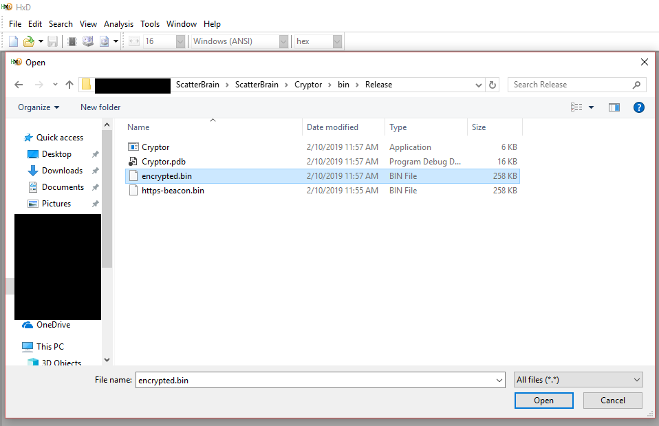
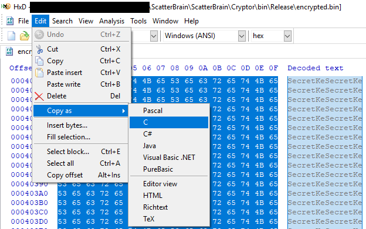
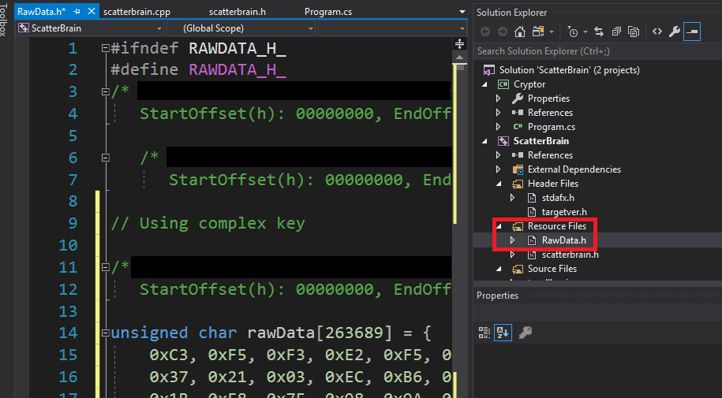
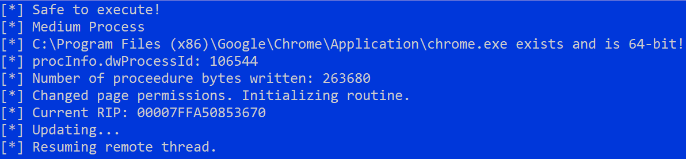
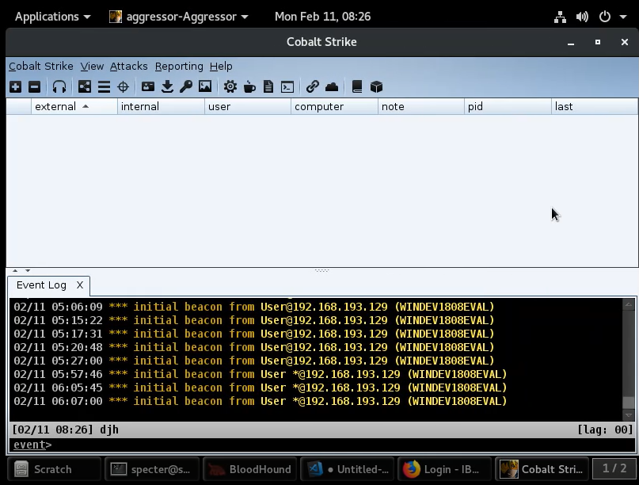
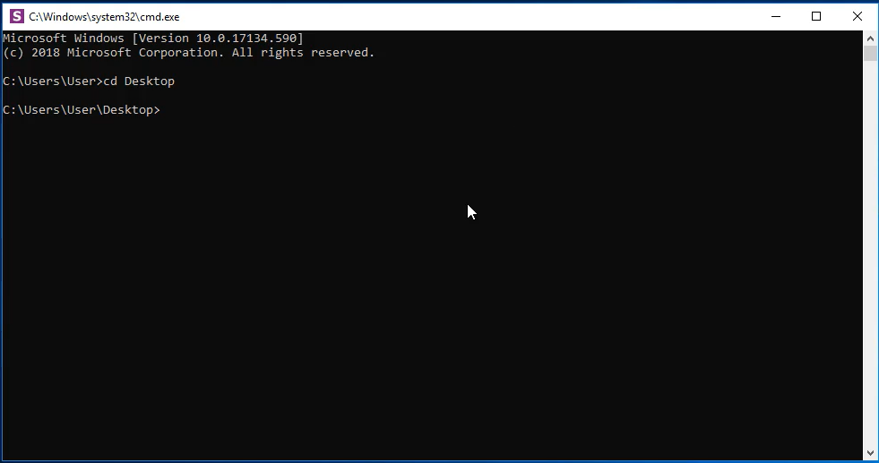

# ScatterBrain Suite

ScatterBrain is a shell code runner with a variety of execution and elevation options. Given unencoded shellcode, it will then be encoded with the XOR key `SecretKey` (found in `Cryptor/Program.cs` and `ScatterBrain/Headers/RawData.h`) using the Cryptor binary. Cryptor.exe generates an `encrypted.bin`, which can be copied into `ScatterBrain/Headers/RawData.h`. You can then build ScatterBrain as a DLL which can be leveraged in one of the templates. Additionally, this will build the .NET Profiler UAC Bypass to use in your operations.

## Table of Contents
- [Cryptor](#Cryptor)
- [ScatterBrain](#ScatterBrain)
    - [CheckPlease Integration](#Check-Please-Integration)
      - [UTC Timezone](#UTC-Timezone)
      - [USB History](#USB-History)
      - [Domain Joined](#Domain-Joined)
      - [Username Exists](#Username-Exists)
      - [Computername Exists](#Computername-Exists)
      - [Sandbox Registry Key Checks](#Sandbox-Registry-Key-Checks)
      - [RAM Requirements](#RAM-Requirements)
      - [Processor Requirements](#Processor-Requirements)
      - [Minimum Number of Processes](#Minimum-Number-Of-Processes)
      - [VM Network Adapters](#VM-Network-Adapters)
      - [VM Drivers Installed](#VM-Drivers-Installed)
      - [Sandbox DLLs](#Sandbox-DLLs)
      - [Debugger Attached](#Debugger-Attached)
      - [Process Tree Validation](#Process-Tree-Validation)

- [DWELLS (UAC Bypass)](#DWELLS)
- [Accessibility Features Persistence](#Accessibility-Features-Persistence)
- [Templates](#Templates)
  - [Registry Free COM Activation](#Registry-Free-COM-Activation)
  - [WMI](#WMI)
- [Video Demo](#Video-Demo)

## Requirements
- [HxD Hex Editor](https://mh-nexus.de/en/hxd/)
  - Alternatively, a way to programmatically copy the encoded shellcode to a C char array.

# Cryptor

## Description

Cryptor is a simple .NET binary to encode your shellcode using the hardcoded key `SecretKey` and generates the encrypted shellcode file.

## Cryptor Usage
1. Copy beacon.bin to the same directory as Cryptor.exe.
2. Run it by: `.\Cryptor.exe beacon.bin`. This will generate the encrypted.bin file.

# ScatterBrain

## Description

ScatterBrain is a shellcode runner that uses process injection based on the integrity level of the executing process to run its code. Process injection is done via CreateRemoteThread in a suspended state using the file backing of LoadLibraryA, then updating the Thread's context to point to our allocated shellcode and executing. (See: https://blog.xpnsec.com/undersanding-and-evading-get-injectedthread/)

If executing from a medium integrity process, ScatterBrain will attempt the following search order for binaries:
  1. Default application handler for HTTPS connections.
  2. Brute-force file existence on Chrome, Chrome SxS and FireFox.
  3. Chat applications installed on the machine (such as Slack and Skype).

If executing from a high integrity context, or if the above fails to resolve any binary, then the application will randomly select one of the following:
- splwow64.exe
- printfilterpipelinesvc.exe
- PrintIsolationHost.exe
- spoolsv.exe
- upnpcont.exe
- conhost.exe
- convertvhd.exe

It performs mild anti-analysis and signature-based tools by never writing a contiguous memory chunk that is the full, unencoded shell code. Think heap spray but within an allocated memory segment until all available space has been written to.

The main working function of this file is `MonsterMind` located in `scatterbrain.cpp`. If you wanted to, for example, remove all safety checks, this is where you'd modify that behavior.

## A Note on Exported Stubs

As the project stands, it builds itself using several exported functions that serve as hijack stubs for the DWELLS project. More on it can be found in the [DWELLS](#DWELLS) section.

## CheckPlease Integration

Integrated into this project is CheckPlease, which is capable of doing several anti-sandbox and anti-analysis checks to ensure the payload does not detonate under a false pretense.

If you wish to change the way "Safe" is defined, you'll need to edit the function `SafeToExecute` in `CheckPlease.cpp`. By default, it checks that:
- Execution occurs within UTC Timezone
- The computer it executes on has a ComputerName
- The process tree from which it is currently executing are signed binaries of Microsoft.

A full list of options to check for are as follows:

### UTC Timezone

Checks the payload is executing in a valid timezone. Function: `IsUTCTimeZone`

### USB History

Ensures that at least one USB drive has been connected to the machine. Function: `HasUSBHistory`

### Domain Joined

Ensures the computer is joined to a domain, with option to specify the domain in which it should be joined. Function: `IsDomainJoined`

### Username Exists

Ensures the username is retrievable and that the username is not User. Lots of images/sandboxes spin up with this default username. Function: `HasUsername`

### ComputerName Exists

Ensures the environment has a retrievable and ComputerName. Function: `HasComputerName`

### Sandbox Registry Key checks

This checks several different registry keys to see if the environment is a VMWare or Oracle virtual box. Function: `HasSandboxRegistryKeys`

### Ram Requirements

Check to see if the current executing environment has at least 4 gbs of RAM installed. Function: `HasMinRAM`

### Processor Requirements

Ensures the computer has a minimum number of processor cores before executing. Minimum: 2. Function: `HasNumberOfProcessors`

### Minimum Number of Processes

Ensures that the computer being detonated on has at least 50 processes running. Could up this to 75 potentially. Function: `HasMinNumProcesses`

### Bad Processes Running

Enumerate the current processes running and cross check them against a list of bad processes known to be run in malware analysis toolkits or VMs. Function: `BadProcessesRunning`

### VM Network Adapters

This checks to see if the computer has any VM network adapters associated to it by cross-referencing its MAC address. Function: `HasVMMacAddress`

### VM Drivers Installed

Check for the presence of drivers on disk that indicate this is a virtual machine. Function: `VMDriversPresent`

### Sandbox DLLs

Checks for DLLs on disk that indicate the the executing process is running under a VM. Function: `HasSandboxDLLs`

### Debugger Attached

Checks to see if a remote debugger has been attached to the executing process. This is done via the API call and not the IsDebugged flag, which is always set to true in newer versions of Windows.

### Process Tree Validation

Check the current process tree to see if the payload is detonating in a suspicious manner. Namely, if any parent process of the executable has an unsigned parent, or a parent whose signature does not match Microsoft Windows Production, this will return FALSE. Function: `HasBadParentProcess`

## ScatterBrain Usage

1. Ensure that in the Project Properties you're building as a DLL. (Note: This is important if you want the UAC bypass binary built simultaneously, otherwise it will fail.)

2. Open encrypted.bin in HxD  (https://mh-nexus.de/en/hxd/)



3. Ctrl+A and click Edit -> Copy As -> C



4. Open `RawData.h` in the ScatterBrain project and paste like so (note: From HxD, this is automatically formatted):



5. Build Release x64 of ScatterBrain. Upon build completion the DLL will be copied to the DNH project's Resources directory.

## Example Runtime


# DWELLS

## Description

DWELLS is a UAC Bypass that gains privileged code execution by creating mock Windows directories. The technique write-up can be found at this article here: https://medium.com/tenable-techblog/uac-bypass-by-mocking-trusted-directories-24a96675f6e

## Usage

1. Ensure ScatterBrain is set to build as a DLL.
2. Build the DWELLS project.
3. Execute the binary with no arguments to execute the shell code in high integrity.

## Usage Notes

The high-integrity becaon will spawn without the usual administrative privileges. To regain your expected privs, just run `getpriv` from the new beacon.

Further, if you wanted to create a `shinject`-able version of the DLL, you'd need to remove the embedded resource and instead create a char array of the ScatterBrain.dll and write the file accordingly. For the sake of automation, the executable route was taken. If you do persue the `shinject` route, use Nick Lander'sRDI project to convert the DWELLS.dll into shellcode. (https://github.com/monoxgas/sRDI/blob/master/PowerShell/ConvertTo-Shellcode.ps1).

# Accessibility Features Persistence

## Description

Accessibility Features Persistence stems from the Vault 7 leak that utilizes registering a new COM object in `HKCU:\Software\Classes\CLSID\`. Once registered it will drop the payload to disk in one of several different locations within APPDATA, followed by creating a new junction folder based on the drop location. The payload will execute when:

1. Upon first installation of the payload.
2. When the system has restarted.
3. More than one day has passed.

**Important note:** You **must** note the GUID generated from the installation for the implant to be properly removed. Otherwise you'll need to hunt down the GUID in the registry which can be a nightmare.

## Usage

```
Usage:
    Arguments:
        install           - Installs the agent.
        uninstall {CLSID} - Uninstalls the given CLSID.

    Examples:
        .\AccessibilityFeaturesPersistence.exe install
        .\AccessibilityFeaturesPersistence.exe uninstall "{a3df199e-bc97-4c87-ada6-4b5287a0d9e5}"
```

## References

https://vanmieghem.io/persisting-like-a-cia-agent/

# Templates

I've included a handful of templates that are simple enough to plug and play. The only change that needs to be made to each template is to base64 encode the ScatterBrain.dll and insert it into the templates.

## Registry Free COM Activation

Registry-free COM activation is an excellent way to export this DLL into a variety of formats, be it JScript, VBScript, VBApplications, WMI event consumers and more. To do so I've built templates for both jscript and vbscript that only require the user to replace the DLL bytes where the templates say `B64_DLL_BYTES_GO_HERE`. To do so (from powershell), issue a `[System.Convert]::ToBase64String([System.IO.File]::ReadAllBytes("$PWD\x64\Release\ScatterBrain.dll")) | clip`. Then paste the base64 string into one of the templates (note the trailing new line if you used `clip`-- you'll want to delete that to be syntactically correct). Now you have a working payload that should work in VBScript or JScript!

## WMI

Once you have weaponized the corresponding JScript or VBScript templates from above, paste the code into the corresponding `regfree_com_activation_templates/wmi.ps1` file or SharpWMI's `Program.cs` and rebuild SharpWMI. You'll be all set to pivot using the DLL.

# Video Demo

## Demo of setting up your first payload:
[](https://drive.google.com/open?id=1SoHH9rNDb4I-ohelkw4NxYHo1RGriHBQ)

## Demo of default safety checks
[](https://drive.google.com/open?id=1-cGYueV9VtNRbAIPQaNayU19zjwwsjeC)
